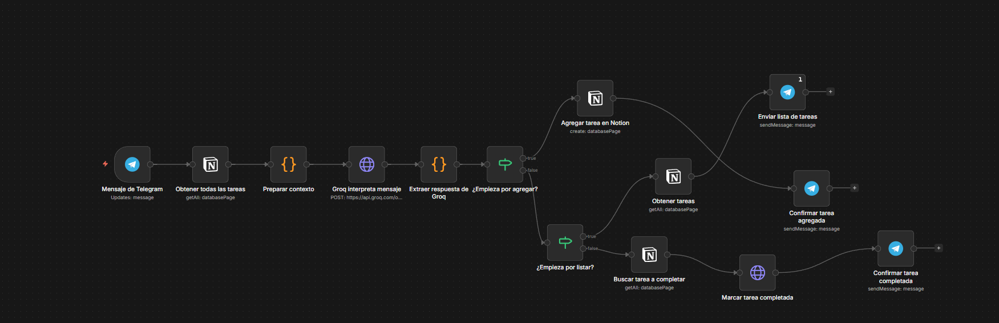

# 🤖 Asistente de Tareas con IA
### Telegram → n8n → Groq → Notion

---

## 📋 Requisitos previos

Antes de empezar necesitas tener instalado y configurado lo siguiente:

| Herramienta | Para qué sirve | Link |
|-------------|---------------|------|
| **Docker Desktop** | Correr n8n localmente | [docker.com](https://www.docker.com/products/docker-desktop) |
| **n8n** | Motor de automatización | [n8n.io](https://n8n.io) |
| **ngrok** | Exponer n8n al internet para recibir mensajes de Telegram | [ngrok.com](https://ngrok.com) |
| **Telegram Bot** | Canal de comunicación con el usuario | @BotFather en Telegram |
| **Groq** | IA que interpreta lenguaje natural (gratis) | [console.groq.com](https://console.groq.com) |
| **Notion** | Base de datos donde se guardan las tareas | [notion.so](https://notion.so) |

---

## ¿Qué hace?

Un bot de Telegram que entiende lenguaje natural y gestiona tus tareas en Notion automáticamente. No necesitas comandos exactos — simplemente escríbele como si fuera una persona.

**Ejemplos de uso:**
- `tengo que pasear el perro la otra semana` → agrega la tarea
- `qué tengo pendiente?` → lista todas las tareas
- `ya llamé al médico` → marca la tarea como completada

---

## 🖼️ Flujo en n8n



---

## 🏗️ Arquitectura del Flujo

```
Mensaje de Telegram
       ↓
Obtener todas las tareas (Notion)
       ↓
Preparar contexto (Code JS)
       ↓
Groq interpreta mensaje → Groq API
       ↓
Extraer respuesta de Groq (Code JS)
       ↓
¿Empieza por agregar?
   ↓ true                    ↓ false
Agregar tarea en Notion    ¿Empieza por listar?
       ↓                      ↓ true        ↓ false
Confirmar tarea agregada  Obtener tareas  ¿Empieza por completar?
                               ↓                    ↓ true
                         Enviar lista        Buscar tarea a completar
                         de tareas                   ↓
                                             Marcar tarea completada
                                                      ↓
                                             Confirmar tarea completada
```

---

## 🧩 Nodos y Configuración

### 1. Mensaje de Telegram
- **Tipo:** Telegram Trigger
- **Evento:** Updates: message
- **Función:** Escucha todos los mensajes que llegan al bot

---

### 2. Obtener todas las tareas
- **Tipo:** Notion → Get Many Database Pages
- **Database:** ID de tu base de datos
- **Return All:** ✅ Activado
- **Función:** Trae todas las tareas existentes para pasárselas a Groq como contexto

---

### 3. Preparar contexto
- **Tipo:** Code in JavaScript
- **Código:**
```javascript
const tareas = $input.all().map(t => t.json.property_nombre).filter(t => t);
const mensaje = $('TelegramTrigger').first().json.message.text;
return [{ json: { tareas: tareas, mensaje: mensaje } }];
```
- **Función:** Combina la lista de tareas con el mensaje del usuario

---

### 4. Groq interpreta mensaje
- **Tipo:** HTTP Request
- **Method:** POST
- **URL:** `https://api.groq.com/openai/v1/chat/completions`
- **Headers:**
  - `Content-Type: application/json`
- **Body:**
```json
{
  "model": "llama3-8b-8192",
  "messages": [
    {
      "role": "system",
      "content": "Tengo estas tareas en mi lista: {{ $json.tareas }}\n\nAnaliza el mensaje y responde SOLO con JSON puro sin markdown:\n{\"accion\": \"agregar\" o \"listar\" o \"completar\", \"tarea\": \"nombre exacto de la tarea de la lista si es completar, o nombre nuevo si es agregar, o null si es listar\"}"
    },
    {
      "role": "user",
      "content": "{{ $json.mensaje }}"
    }
  ]
}
```

---

### 5. Extraer respuesta de Groq
- **Tipo:** Code in JavaScript
- **Código:**
```javascript
const respuesta = $input.first().json.choices[0].message.content;
const parsed = JSON.parse(respuesta);
return [{ json: parsed }];
```
- **Función:** Extrae y parsea el JSON que devuelve Groq

---

### 6. ¿Empieza por agregar?
- **Tipo:** IF
- **Condición:** `{{ $json.accion }}` **is equal to** `agregar`

---

### 7. Agregar tarea en Notion
- **Tipo:** Notion → Create Database Page
- **Database:** ID de tu base de datos
- **Title:** `{{ $json.tarea }}`
- **Estado:** Pendiente
- **Fecha:** `{{ $now.toISO() }}`

---

### 8. Confirmar tarea agregada
- **Tipo:** Telegram → Send Message
- **Chat ID:** `{{ $('TelegramTrigger').item.json.message.chat.id }}`
- **Text:** `✅ Listo! Agregué la tarea: "{{ $('Extraer respuesta de Groq').first().json.tarea }}"`

---

### 9. ¿Empieza por listar?
- **Tipo:** IF
- **Condición:** `{{ $json.accion }}` **is equal to** `listar`

---

### 10. Obtener tareas
- **Tipo:** Notion → Get Many Database Pages
- **Database:** ID de tu base de datos
- **Return All:** ✅ Activado

---

### 11. Enviar lista de tareas
- **Tipo:** Telegram → Send Message
- **Settings → Execute Once:** ✅ Activado
- **Chat ID:** `{{ $('TelegramTrigger').item.json.message.chat.id }}`
- **Text:**
```
📋 Tus tareas pendientes:
{{ $input.all().map(t => '• ' + t.json.property_nombre).join('\n') }}
```

---

### 12. ¿Empieza por completar?
- **Tipo:** IF
- **Condición:** `{{ $json.accion }}` **is equal to** `completar`

---

### 13. Buscar tarea a completar
- **Tipo:** Notion → Get Many Database Pages
- **Filter → Property:** Nombre
- **Condition:** Equals
- **Value:** `{{ $('Extraer respuesta de Groq').first().json.tarea }}`

---

### 14. Marcar tarea completada
- **Tipo:** HTTP Request (Notion API directa)
- **Method:** PATCH
- **URL:** `https://api.notion.com/v1/pages/{{ $json.id }}`
- **Headers:**
  - `Notion-Version: 2022-06-28`
  - `Content-Type: application/json`
- **Body:**
```json
{
  "properties": {
    "Estado": {
      "select": {
        "name": "Completada"
      }
    }
  }
}
```

---

### 15. Confirmar tarea completada
- **Tipo:** Telegram → Send Message
- **Chat ID:** `{{ $('TelegramTrigger').item.json.message.chat.id }}`
- **Text:** `✅ Marqué como completada: "{{ $('Extraer respuesta de Groq').first().json.tarea }}"`

---

## 🗃️ Base de Datos en Notion

| Propiedad | Tipo | Descripción |
|-----------|------|-------------|
| Nombre | Title | Nombre de la tarea |
| Estado | Select | Pendiente / Completada |
| Fecha | Date | Fecha de creación (con hora) |

---

## 🚀 Cómo levantar el proyecto

```bash
# 1. Iniciar Docker Desktop
# 2. En la carpeta del proyecto:
docker compose up -d

# 3. Levantar ngrok:
ngrok http 5678

# 4. Entrar a n8n:
# http://localhost:5678

# 5. Activar el workflow (toggle verde)
```

---

## 🔑 Credenciales necesarias

| Servicio | Dónde obtenerla |
|----------|----------------|
| Telegram Bot Token | @BotFather en Telegram |
| Groq API Key | console.groq.com (gratis) |
| Notion Token | notion.so/my-integrations |
| Notion Database ID | URL de tu base de datos |

---

## 💡 Posibles mejoras futuras

- 🗓️ **Recordatorios** — `recordar: tarea | mañana 9am`
- 📊 **Resumen** — `cuántas tareas tengo pendientes?`
- 🏷️ **Prioridades** — `agregar urgente: presentación`
- 📅 **Fechas límite** — `tengo que entregar el informe el viernes`

---

*Proyecto construido con n8n + Groq (LLaMA 3) + Notion + Telegram*
