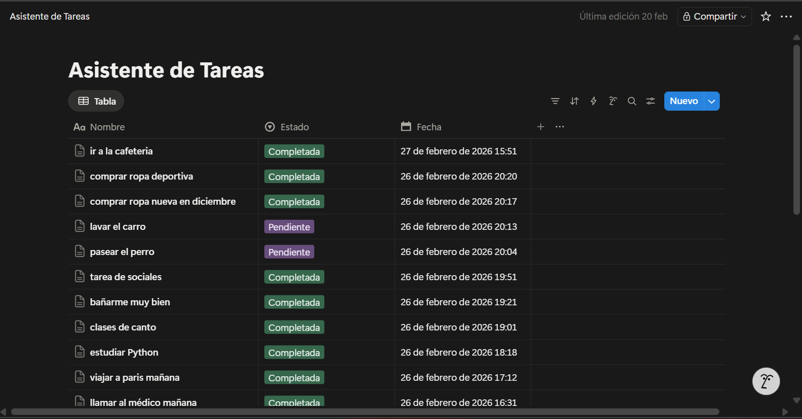
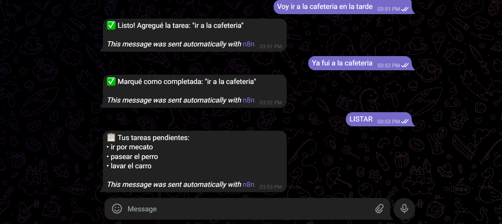

# 🤖 Asistente de Tareas — Bot de Telegram con Notion y Groq

Un flujo de automatización en **n8n** que permite gestionar tareas en **Notion** directamente desde **Telegram**, usando **Groq (LLaMA 3.3)** como motor de interpretación de lenguaje natural.

---

## 📌 ¿Qué hace este proyecto?

El bot escucha mensajes en Telegram y, sin necesidad de comandos exactos, entiende la intención del usuario gracias a un modelo de lenguaje. Puede:

- ✅ **Agregar** una nueva tarea a la base de datos de Notion
- 📋 **Listar** las tareas pendientes
- ☑️ **Marcar como completada** una tarea existente

El usuario simplemente escribe en lenguaje natural, por ejemplo:
- *"Agrega comprar leche"*
- *"¿Qué tengo pendiente?"*
- *"Ya terminé el informe mensual"*

---

## 🖼️ Imágenes del proyecto

### Flujo principal en n8n

> _Insertar aquí captura de pantalla del flujo completo en n8n_


---

### Listado de tareas en Notion

> _Insertar aquí captura de pantalla de la base de datos de Notion con las tareas_



---

### Conversación de ejemplo con el bot en Telegram

> _Insertar aquí captura de pantalla de la conversación en Telegram_



---

## 🧱 Arquitectura del flujo

```
Telegram (trigger)
    └─► Obtener todas las tareas (Notion)
            └─► Preparar contexto
                    └─► Groq interpreta mensaje (LLaMA 3.3)
                            └─► Extraer respuesta de Groq
                                    ├─► [agregar] Agregar tarea en Notion → Confirmar tarea agregada (Telegram)
                                    ├─► [listar]  Obtener tareas pendientes (Notion) → Enviar lista (Telegram)
                                    └─► [completar] Buscar tarea → Marcar como completada → Confirmar (Telegram)
```

---

## 🔩 Nodos del flujo

| Nodo | Tipo | Descripción |
|------|------|-------------|
| `Mensaje de Telegram` | Trigger | Escucha nuevos mensajes del bot |
| `Obtener todas las tareas` | Notion | Recupera todas las páginas de la base de datos para dar contexto al LLM |
| `Preparar contexto` | Code (JS) | Construye el payload con la lista de tareas y el mensaje del usuario |
| `Groq interpreta mensaje` | HTTP Request | Envía el contexto a la API de Groq y recibe la acción a ejecutar en formato JSON |
| `Extraer respuesta de Groq` | Code (JS) | Parsea el JSON devuelto por el modelo |
| `¿Empieza por agregar?` | IF | Ramifica si la acción es `agregar` |
| `¿Empieza por listar?` | IF | Ramifica si la acción es `listar` o `completar` |
| `Agregar tarea en Notion` | Notion | Crea una nueva página en la base de datos con estado `Pendiente` |
| `Obtener tareas` | Notion | Filtra y devuelve solo las tareas con estado `Pendiente` |
| `Buscar tarea a completar` | Notion | Busca la tarea por nombre para obtener su ID |
| `Marcar tarea completada` | HTTP Request (PATCH) | Actualiza el estado de la página en Notion a `Completada` vía API |
| `Enviar lista de tareas` | Telegram | Responde con el listado de pendientes formateado |
| `Confirmar tarea agregada` | Telegram | Confirma al usuario que la tarea fue creada |
| `Confirmar tarea completada` | Telegram | Confirma al usuario que la tarea fue marcada como completada |

---

## 🛠️ Requisitos y configuración

### Credenciales necesarias

Antes de importar el flujo en n8n, configura las siguientes credenciales:

| Servicio | Tipo de credencial en n8n | Dónde obtenerla |
|----------|--------------------------|-----------------|
| **Telegram** | `telegramApi` | [BotFather](https://t.me/BotFather) — crea un bot y copia el token |
| **Notion** | `notionApi` | [Notion Integrations](https://www.notion.so/my-integrations) — crea una integración interna |
| **Groq** | `groqApi` | [console.groq.com](https://console.groq.com) — genera una API key |

### Base de datos de Notion

La base de datos debe tener las siguientes propiedades:

| Propiedad | Tipo | Valores posibles |
|-----------|------|-----------------|
| `Nombre` | Title | Nombre de la tarea |
| `Estado` | Select | `Pendiente`, `Completada` |
| `Fecha` | Date | Fecha de creación |

> ⚠️ Asegúrate de compartir la base de datos con tu integración de Notion (botón **Conectar** en la esquina superior derecha de la base de datos).

### IDs a actualizar en el flujo

Después de importar el JSON, actualiza el ID de la base de datos de Notion en los siguientes nodos:

- `Obtener todas las tareas`
- `Agregar tarea en Notion`
- `Obtener tareas`
- `Buscar tarea a completar`

---

## 🚀 Cómo usar

1. Importa el archivo `asistente-tareas.json` en tu instancia de n8n (**Workflows → Import**).
2. Configura las credenciales de Telegram, Notion y Groq.
3. Actualiza el ID de tu base de datos de Notion en los nodos correspondientes.
4. Activa el flujo.
5. Abre tu bot en Telegram y empieza a escribir en lenguaje natural.

---

## 💬 Ejemplos de uso

| Mensaje del usuario | Acción ejecutada |
|--------------------|-----------------|
| `Agrega llamar al médico` | Crea tarea "llamar al médico" en Notion |
| `¿Qué tengo pendiente?` | Lista todas las tareas con estado Pendiente |
| `Ya terminé el reporte` | Busca "reporte" en Notion y lo marca como Completada |
| `Añade revisar el correo` | Crea tarea "revisar el correo" en Notion |

---

## ⚙️ Modelo de lenguaje

El flujo utiliza **LLaMA 3.3 70B Versatile** a través de la API de Groq. El modelo recibe:

- La lista actual de tareas en Notion (para identificar tareas existentes al completar)
- El mensaje del usuario

Y devuelve siempre un JSON estructurado con dos campos:

```json
{
  "accion": "agregar" | "listar" | "completar",
  "tarea": "nombre de la tarea o null si es listar"
}
```

---

## 📁 Estructura del repositorio

```
asistente-tareas/
├── README.md
├── asistente-tareas.json       # Flujo exportado de n8n
└── imagenes/
    ├── flujo-n8n.png
    ├── notion-n8n.png
    └── telegram-n8n.png
```

---

## 📄 Licencia

Este proyecto es de uso libre. Puedes modificarlo y adaptarlo a tus necesidades.
